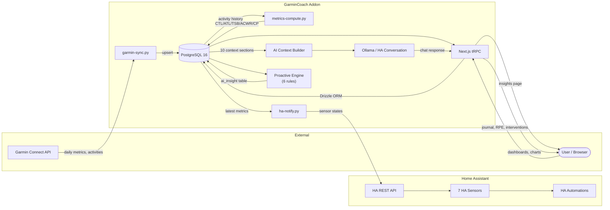

# Garmin Setup - Complete Architecture Explained

**Date**: 2026-02-12  
**Status**: ✅ All pieces identified!

---

## 🧩 Your Complete Garmin Setup

You have **THREE separate** Garmin-related components:

### 1. HACS Garmin Connect Integration ✅
**Location**: `/config/custom_components/garmin_connect`  
**What it does**: 
- Fetches data from Garmin Connect API
- Creates Home Assistant sensors (steps, calories, heart rate, etc.)
- Updates every 5 minutes
- Data lives in **Home Assistant state database**

**Source**: https://github.com/cyberjunky/home-assistant-garmin_connect  
**Type**: Home Assistant integration (via HACS)  
**Does it include Grafana?**: ❌ NO

### 2. Grafana HAOS Addon ✅
**Addon ID**: `a0d7b954_grafana`  
**Access URLs**:
- Direct: http://192.168.1.176:3000
- Ingress: https://haos.askb.dev/a0d7b954_grafana

**What it does**:
- Visualization platform
- Creates dashboards and graphs
- Your `garmin-stats` dashboard lives here

**Source**: HAOS Community Add-ons  
**Type**: HAOS addon (installed separately from HACS integration)

### 3. InfluxDB HAOS Addon ✅
**Location**: http://192.168.1.176:8086  
**Database**: `garmin`

**What it does**:
- Time-series database
- Stores 2,226 days of historical Garmin data (2020-2026)
- Fed by our Python sync script from laptop

**Source**: HAOS official addon  
**Type**: HAOS addon (installed separately)

---

## 🔄 Data Flow Architecture

### Setup #1: HACS Integration → Home Assistant
```
Garmin Connect API
    ↓ (every 5 minutes)
HACS Integration (garmin_connect)
    ↓
Home Assistant Sensors
    ↓
HA Database (SQLite)
    ↓ (can be used in)
HA Dashboards / Lovelace Cards
```

### Setup #2: Python Script → InfluxDB → Grafana (What We Just Built)
```
Garmin Connect API
    ↓ (laptop script with tokens)
Python sync.py
    ↓ (HTTP POST)
InfluxDB on HAOS (192.168.1.176:8086)
    ↓ (InfluxQL queries)
Grafana Dashboard (garmin-stats)
    ↓
Visualization
```

---

## 🤔 Which Data Is Your Grafana Dashboard Using?

**Question**: Is your `garmin-stats` dashboard using:
- **Option A**: HACS integration data (via Home Assistant datasource)?
- **Option B**: InfluxDB data (via our sync script)?
- **Option C**: Something else?

**To find out**, check the dashboard:
1. Open: http://192.168.1.176:3000/d/feiibsx498gsgb/garmin-stats
2. Click any panel → **Edit**
3. Look at **Data source** dropdown at top
4. What does it say?
   - `garmin_influxdb` → Using our InfluxDB data ✅
   - `Home Assistant` → Using HACS integration data
   - Something else?

---

## 💡 Why You Might Have Both

**HACS Integration** (HA sensors):
- ✅ Real-time data (updates every 5 minutes)
- ✅ Easy to use in HA automations
- ✅ No OTP issues after initial setup
- ❌ Limited history (HA purges old data)
- ❌ Less flexible visualization

**InfluxDB + Python Sync**:
- ✅ Unlimited history (6+ years!)
- ✅ Powerful Grafana visualizations
- ✅ Can aggregate/analyze historical trends
- ❌ Requires script to keep updated
- ❌ Not directly usable in HA automations

**Best of both worlds**: Keep both!
- Use HACS integration for HA automations and current data
- Use InfluxDB+Grafana for historical analysis and pretty graphs

---

## 🎯 Recommendations

### Current State
✅ **HACS Garmin Connect**: Already installed and working  
✅ **Grafana**: Installed and accessible  
✅ **InfluxDB**: Installed with 6 years of data synced  
✅ **Dashboard**: `garmin-stats` exists and working

### Next Steps

1. **Find out which datasource your dashboard uses**:
   - Edit a panel and check the datasource

2. **If using HACS integration data**:
   - You might want to recreate dashboard using InfluxDB for historical data
   - Or keep it as-is if it's working well

3. **If already using InfluxDB**:
   - You're all set! Everything is optimal

4. **Setup automation** for daily sync:
   - Cron job to run `sync.py` every few hours
   - Keeps InfluxDB fresh with latest data

---

## 📋 Summary

**What you have**:
- HACS integration: Real-time HA sensors
- Grafana: Visualization platform (port 3000)
- InfluxDB: Historical data storage
- Dashboard: Already created with your data

**Grafana was NOT installed by HACS** - you (or someone) installed it separately as an addon, probably to visualize Garmin data!

**Both setups are valid and can coexist perfectly!**

---

**Last Updated**: 2026-02-12  
**Status**: ✅ Complete architecture documented

---

## 🏗️ GarminCoach Addon — Full Data Flow Architecture

**Added**: 2026-03-22

The GarminCoach HA addon runs as an s6-overlay multi-service container with
PostgreSQL 16, three Python background services, and a Next.js standalone
server.

### Data Flow Diagram



### Service Loop Timing

| Service | Startup Delay | Loop Interval | What It Does |
|---------|--------------|---------------|--------------|
| `garmin-sync.py` | 0s (waits for tokens) | Every `sync_interval_minutes` (default 60) | Pulls daily metrics + activities from Garmin Connect → PostgreSQL |
| `metrics-compute.py` | 120s | Every 60 min | Computes EWMA CTL/ATL/TSB/ACWR/CP → `advanced_metric` table |
| `ha-notify.py` | 180s | Every 30 min | Pushes 7 sensors to HA REST API, fires injury-risk alerts |

### HA Sensors Pushed

| Sensor | Source |
|--------|--------|
| `sensor.garmincoach_ctl` | `advanced_metric.ctl` |
| `sensor.garmincoach_atl` | `advanced_metric.atl` |
| `sensor.garmincoach_form` | `advanced_metric.tsb` |
| `sensor.garmincoach_acwr` | `advanced_metric.acwr` |
| `sensor.garmincoach_injury_risk` | Derived from ACWR thresholds |
| `sensor.garmincoach_body_battery` | `daily_metric.body_battery` |
| `sensor.garmincoach_sleep_debt` | Computed from `daily_metric.sleep_duration` |

### Database Tables (22 in Next.js app)

Key tables used by addon services:
- `daily_metric` — raw Garmin data (sync target)
- `activity` — workout records (sync target)
- `advanced_metric` — computed CTL/ATL/TSB/ACWR/CP (metrics-compute output)
- `athlete_baseline` — personal norms + z-scores
- `ai_insight` — proactive insight cards (6-rule engine output)
- `journal_entry` — user daily check-ins
- `session_report` — post-activity RPE
- `intervention` — recovery intervention log
